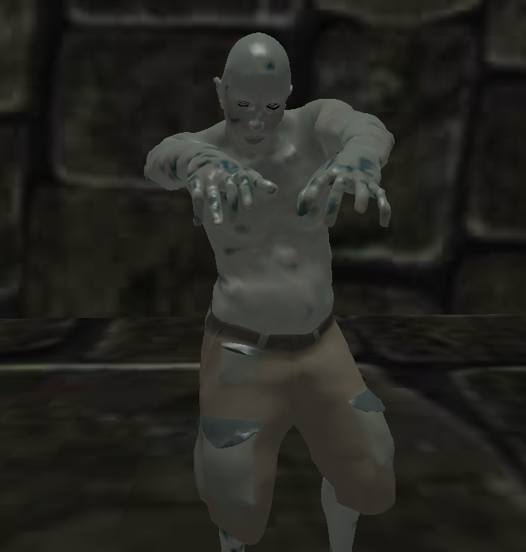
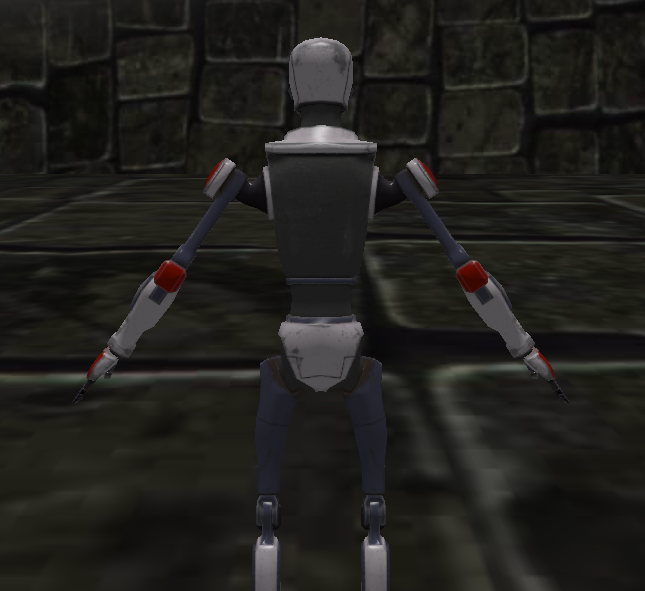

# Trabalho Final - Fundamentos de Computação Gráfica (INF01047)

## Integrantes:

- Arthur Alves Ferreira Melo (00333985)
- Sofia Maciel D'avila (00323829)

## Conceito de jogo

Shooter de ondas inspirado em Binding of Isaac/Journey of the Prairie King (minigame de Stardew Valley).

O jogador nascerá no meio de um mapa quadrangular de onde inimigos virão dos 4 pontos cardeais em direção a ele.  
Ele está equipado com uma pistola e um bumerange, acessáveis por hotkeys.  
Ao vencer uma certa quantidade de inimigos, o jogo passa para uma próxima fase, em um total de três fases, na qual os inimigos estão mais rápidos e numerosos.

## Contribuições de cada membro da dupla

O projeto foi desenvolvido inteiramente em *pair programming*, utilizando a função *Code With Me* do CLion, que permite o acesso simultâneo dos dois aos mesmos arquivos. Em suma, ambos os integrantes do grupo tiveram contribuições em todas as classes e funções implementadas. Além de testes, refatoração e decisões estéticas.

## Utilização de ChatGPT

Para o desenvolvimento do trabalho, o ChatGPT foi utilizado para resolução de questões geométricas como, por exemplo, como descobrir a posição do ponto auxiliar na curva de Bézier implementada. Também foi utilizado como auxiliar para desenvolvimento das funções de colisão - a fim de facilitar o raciocínio de bounding boxes.

A ferramenta se provou muito útil para quesitos matemáticos, mas não tão útil para programação em si, conseguindo ensinar métodos matemáticos, mas incapaz de realmente escrever algoritmos úteis dentro do contexto da aplicação.

## Processo de desenvolvimento

O projeto foi separado nas seguintes classes: Camera, collisions, LoadedObj, Model, Renderer, SceneObject e Window.

- Possibilitar interação com o usuário via mouse/teclado.

Na classe Window, foram implementados *callbacks* que recebem os *inputs* do usuário e ativam variáveis booleanas dentro do objeto da classe Camera, que então, são utilizados para interação com o jogo.

- Objetos virtuais representados em malhas complexas.

Na classe Window, os *shaders* são lidos sendo inseridos ao Renderer objetos da classe Model, que contém um LoadedObj, inserindo-os na cena virtual contida no Renderer.

- Transformações geométricas de objetos virtuais.

Na classe Model e Renderer, existem funções que alteram uma matriz por transformações geométricas, determinando onde o objeto vai ser renderizado, a partir do *input* do usuário ou informações do jogo.

- Controle de câmeras virtuais.

Na classe Camera, foram implementadas funções que controlam o funcionamento da câmera livre e Look-At. Na classe Window, é criado um objeto Camera a partir do qual são definidos a posição, tipo (livre ou Look-At), e demais atributos, conforme *input* do usuário.

- No mínimo, um objeto virtual deve ser copiado com duas ou mais instâncias.

Na classe Renderer, existe um vetor de uma *struct* que controla informações a respeito de posição e rotação de instâncias individuais do modelo do zumbi, então ao renderizar o modelo, todas as instâncias são renderizadas em suas respectivas posições e rotações.

- Testes de colisão entre objetos virtuais.

Na classe collisions foram implementadas três funções de teste de colisão: cubo-caixa, cilindro-cilindro e cubo-cilindro. A função de cubo-caixa é utilizada para testar a colisão do modelo do jogador e do bumerange com o cenário. A função de cilindro-cilindro é utilizada para testar a colisão dos inimigos com o jogador. A função de cubo-cilindro é utilizada para testar a colisão do projétil com os inimigos. Cada uma delas é chamada na classe Model, onde os casos são tratados.

- Modelos de iluminação de objetos geométricos.

Nos *shaders* foi implementada iluminação de Lambert e Blinn-Phong para todos os modelos.

Também foi feito Gouraud shading para o modelo do zumbi e Phong shading para os demais.

- Mapeamento de texturas.

Nos *shaders* é realizado um mapeamento de textura a partir de das coordenadas de textura já presente nos arquivos obj. Cada modelo tem uma textura específica, totalizando cinco texturas distintas.

- Curvas de Bézier.

O ataque secundário do jogador, implementado na classe Model, tem a trajetória de uma curva de Bézier de grau 2, formada pelos seguintes pontos: a posição do jogador, o ponto final do ataque (posição do jogador + alcance do ataque * direção) e um ponto auxiliar, gerado a partir de um certo distanciamento do jogador e um ângulo a ser formado entre os dois pontos de referência.

- Animação de Movimento baseada no tempo.

Todas as animações e movimentações da câmera realizadas na classe Renderer utilizam de um ∆t que determina o intervalo entre frames.

## Como jogar

O jogo se inicializa pausado com o jogador no centro da arena. Ao despausar, o jogador pode se mover e controlar a câmera através do teclado e atacar os zumbis com seu bumerange através do mouse.

Ao ser atingido por um zumbi, o jogador morre e o jogo fecha.

### Controles

- W: move-se para frente
- A: move-se para esquerda
- S: move-se para trás
- D: move-se para direita
- Space: pausa/despausa o jogo
- C: altera o tipo de câmera
- M1: tiro primário
- M2: tiro secundário
- Scroll: controla proximidade da câmera

## Como compilar e executar

Só é necessário buildar o projeto a partir do CMakeLists para a compilação do programa.